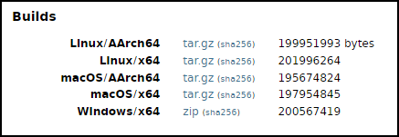

# Installazione e configurazione dell'ambiente di sviluppo di Java

L’ambiente di sviluppo della piattaforma Java (Java Development Kit) è disponibile all’URL http://jdk.java.net/21/, dove si può ottenere il file di installazione relativo al sistema operativo utilizzato.

Nella pagina web indicata è infatti presente una sezione *Builds* dove sono visualizzate delle righe, ciascuna indicante, per il relativo sistema operativo, un file compresso (formato `zip` o `tar.gz`) per il JDK a 64 bit.

Queste builds sono relative alla versione open-source di Java (OpenJDK) mentre all'URL https://www.oracle.com/java/technologies/downloads/?er=221886#java21 è possibile
accedere alle builds commerciali di Java fornite da Oracle con licenze non open-source.

> [!CAUTION]
> Gli URL indicati nella presente guida sono quelli attivi alla data di pubblicazione del libro (ottobre 2024), pertanto potrebbero essere non più presenti quando il lettore deciderà di utilizzarli.
>
> Riferirsi, se quello è il caso, all'URL https://jdk.java.net/, e poi da lì selezionare il link relativo all'ultima versione del JDK disponibile per accedere alle sezioni di builds prima indicate.

Nel nostro caso useremo la versione open-source del JDK: per Windows (Windows 11), il file `openjdk-21.0.2_windows-x64_bin.zip`; per GNU/Linux (Fedora 40), il file `openjdk-21.0.2_linux-x64_bin.tar.gz`; per macOS (Sonoma 14.6), il file `openjdk-21.0.2_macos-x64_bin.tar.gz`.

## Windows

Decomprimiamo il file `openjdk-21.0.2_windows-x64_bin.zip` e copiamo la directory dove preferiamo (per noi `D:\Java\jdk-21.0`).
Configuriamo quindi la variabile d’ambiente `Path` indicando il percorso nel quale si trovano gli eseguibili del linguaggio (`java.exe`, `javac.exe` e così via).

Effettuiamo quanto segue:

- premiamo il tasto `Windows` e digitiamo la sequenza di caratteri `variabili di ambiente` finché nell’area di risultato della ricerca dal menu `Start` non apparirà la scritta `Modifica le variabili di ambiente relative al sistema`, quindi selezionarla;
- dalla finestra `Proprietà del sistema`, tab `Avanzate`, facciamo clic su `Variabili d'ambiente...`;
- dalla finestra `Variabili d'ambiente`, area `Variabili di sistema`, facciamo doppio clic sulla voce `Path`;
- dalla finestra `Modifica variabili di ambiente` facciamo clic su `Nuovo` e inseriamo nella casella di testo il path completo della directory bin del JDK (per noi, `D:\java\jdk-21.0.2\bin`);
- confermiamo le operazioni indicate chiudendo tutte le finestre rimaste aperte.
- verifichiamo che il path è impostato correttamente aprendo un prompt dei comandi e digitiamo `java --version` che dovrà mostrare come output qualcosa come: `javac 21.0.2`.

## GNU/Linux

Decomprimiamo il file `openjdk-21.0.2_linux-x64_bin.tar.gz` (*Linux gzip tarball*) e copiamo la directory `jdk-21.0.2` nel percorso desiderato (per noi sarà `/opt`). Quindi, impostiamo o aggiorniamo la variabile d’ambiente `PATH` con la seguente istruzione `PATH=$PATH:/opt/jdk-21.0.2/bin`.

L’istruzione suindicata./ba  può essere scritta:

- nel file `~/.bashrc`, se si accede al sistema in modalità grafica (*interactive non-login shell*). Il path indicato sarà disponibile solo per l'utente corrente;
- nel file `~/.bash_profile` se si accede al sistema in modalità testuale (*interactive login shell*). Aggiungere, se non già presente, anche la seguente istruzione `export PATH`. Il path indicato sarà disponibile solo per l'utente corrente;
- nel file `/etc/profile` come utente root. Il path indicato sarà disponibile per qualsiasi utente del sistema.

> [!TIP]
> Se decidiamo di modificare la variabile `PATH` nei file `.bashrc`, `.bash_profile`o `profile`, possiamo rendere subito "operativa" tale modifica, invocando, per esempio, il comando seguente:
>  `source .bash_profile`

> [!IMPORTANT]
> In alcuni sistemi può essere già disponibile un runtime di Java che potrebbe creare problemi di conflitto con il nuovo JDK 21 installato.
> Per verificare se sono presenti altri runtime di Java eseguire il seguente comando:
> `sudo update-alternatives --display java`
> In caso di presenza di più JDK, per cambiare quello da utilizzare eseguire i comandi seguenti:
> `sudo alternatives --install /usr/bin/java java /opt/jdk-21.0.2/bin/ 1` 
> e poi:
> `update-alternatives --config java` 
> laddove quest’ultimo comando consente di scegliere il JDK da usare (nel nostro caso digiteremo `2` e poi premeremo `Invio`).

## macOS

Decomprimiamo il file `openjdk-21.0.2_macos-x64_bin.tar.gz` e copiamo la directory `jdk-21.0.2.jdk` come indicato dal seguente comando:
`sudo mv jdk-21.0.2.jdk /Library/Java/JavaVirtualMachines`

Possiamo successivamente fare quanto segue:

- verifichiamo che il sistema riconosce dove è stato installato il JDK con il comando:
`/usr/libexec/java_home -V`
(per noi produrrà `/Library/Java/JavaVirtualMachines/jdk-21.0.2.jdk/Contents/Home`);
- configuriamo la variabile di ambiente `PATH`: 
  - aggiungiamo nel file `.bash_profile` i comandi `PATH=$PATH:/Library/Java/JavaVirtualMachines/jdk-21.0.2.jdk/Contents/Home/bin` e poi `export PATH`;
  - da terminale digitiamo:`source .bash_profile` per applicare immediatamente i cambiamenti (ricordiamo che in questo caso solo l’utente corrente ne vedrà l’esito); se, invece, vogliamo che il percorso dei binari del JDK sia disponibile per tutti gli utenti allora possiamo scriverlo nel file `/etc/paths` oppure possiamo creare un file ad hoc che contiene quel percorso, per esempio `javapath`, e inserirlo nella directory `/etc/paths.d`; quest’ultima modalità è quella consigliata da Apple, perché il sistema utilizzerà in automatico l’utility `path_helper` che provvederà a leggere qualsiasi file presente in `/etc/paths.d` e ad aggiornare la variabile `PATH` con le informazioni lì trovate.

> [!TIP]
> L'impostazione della variabile d'ambiente `PATH` non è tipicamente necessaria perché macOS è configurato per cercare automaticamente le installazioni di Java nella directory `/Library/Java/JavaVirtualMachines`. Ovviamente, se abbiamo più installazioni di Java presenti nella suddetta directory, l'impostazione della variabile `PATH` potrebbe essere necessaria per indicare quale di esse utilizzare.
  
## La variabile di ambiente JAVA_HOME

Come abbiamo visto l’impostazione della variabile d’ambiente `Path` (o `PATH`) è importante perché consente di utilizzare gli eseguibili del linguaggio Java dalla riga di comando senza dover inserire il loro percorso completo. Tuttavia vi possono essere dei programmi che utilizzano la variabile d’ambiente `JAVA_HOME` per localizzare il percorso nel quale è installato, per esempio, il corrente JDK di Java, e poterlo così utilizzare di conseguenza. Consigliamo, quindi, di impostare anche la variabile `JAVA_HOME` nel proprio sistema: per Windows, ripetere la stessa procedura vista per l'impostazione della variabile `Path`; per GNU/Linux, impostarla nei file `.bashrc` o `.bash_profile`; per macOS, impostarla nel file `.bash_profile`, in `/etc/paths` o tramite il `path_helper`.  In questi ultimi sistemi, per esempio, è possibile scrivere qualcosa come: `JAVA_HOME=/opt/jdk-21` e poi `export JAVA_HOME`.

## Documentazione del JDK di Java

Se lo si desidera, è possibile anche scaricare in locale la documentazione completa delle API della piattaforma Java SE e del JDK cliccando sul link `jdk-21.0.2_doc-all.zip` presente all’URL https://www.oracle.com/java/technologies/javase-jdk21-doc-downloads.html. Al termine del download si avrà quindi a disposizione un file zip che, dopo la decompressione, conterrà la cartella `docs`, al cui interno si troverà un file `index.html` la cui apertura permetterà la navigazione nella documentazione visualizzata.

## Codice sorgente

Nel path di installazione del JDK, sotto la directory `lib`, è presente il file `src.zip` che contiene i file di codice sorgente di tutte le classi che compongono la *Java Class Library*. Per visualizzarle e studiarle è dunque sufficiente scompattare il file `.zip` indicato in qualsiasi percorso si desidera. In più, all'URL https://github.com/openjdk/jdk, è presente il repository *git* del corrente OpenJDK dove è possibile visualizzare i file di codice sorgente della sua *main-line development* così come la documentazione su come costruirsi delle distribuzioni binarie.

## Terminologia essenziale

- **Java Platform, Standard Edition (Java SE)**: specifica della piattaforma propria del linguaggio Java e delle sue API per un utilizzo per applicazioni desktop e semplici applicazioni server.
- **JDK (Java Development Kit)**: insieme di strumenti e librerie che consentono di sviluppare, compilare, eseguire e debuggare applicazioni scritte in linguaggio Java. Esso rappresenta nella sostanza un'implementazione concreta di una Java SE.
- **JRE (Java Runtime Environment)**: ambiente di runtime necessario per eseguire applicazioni scritte in linguaggio Java. Contiene fondamentalmente la JVM e le librerie standard.
- **JVM (Java Virtual Machine)**: componente software che interpreta ed esegue il bytecode Java.
- **Bytecode**: codice in linguaggio "intermedio" prodotto dal compilatore Java che è interpretabile ed eseguibile da una macchina virtuale Java.
- **OpenJDK**: JDK open-source di Java SE.
- **Oracle JDK**: JDK non open-source di Java SE sviluppata da Oracle (sono presenti sul mercato altri vendor che forniscono un proprio JDK di Java: Azul, IBM, Amazon, Red Hat, e così via).
- **Reference Implementation**: indica, in linea generale, un'implementazione di riferimento rigorosa di un linguaggio di programmazione o di una specifica: nello specifico possiamo quindi dire che, per esempio, OpenJDK è una reference implementation di Java SE che garantisce che tutte le specifiche siano correttamente implementate.
