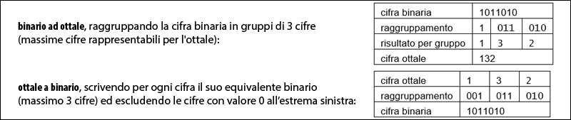

# Sistemi Numerici: cenni

I numeri possono essere rappresentati con cifre il cui intervallo e la cui base variano secondo il sistema di numerazione scelto. Possiamo, infatti, avere un sistema numerico:

- *decimale* (base 10), dove le cifre vanno da 0 a 9;
- *ottale* (base 8), dove le cifre vanno da 0 a 7;
- *esadecimale* (base 16), dove le cifre vanno da 0 a 15 (e dove le cifre da 10 a 15 si scrivono A, B, C, D, E e F);
- *binario* (base 2), dove le cifre sono 0 e 1.

Tutti i sistemi suddetti utilizzano una notazione definita come posizionale (Figura 1) dove ogni posizione nella quale è stata scritta la cifra ha l’attribuzione di un differente valore, per l’appunto, posizionale. Ogni posizione è, inoltre, espressa come potenza delle basi e tali potenze partono dal valore 0 e aumentano di un’unità spostandosi a sinistra per ogni cifra che compone il numero.

**Figura 1** Notazione posizionale dei sistemi di numerazione.

Di seguito vediamo una serie di immagini (Figure 2, 3, 4, 5, 6. 7, 8 e 9) che mostrano in sequenza: le conversioni tra le basi, le operazioni aritmetiche binarie e i numeri negativi.

**Figura 2** Binario a ottale – ottale a binario.

**Figura 3** Binario a esadecimale – esadecimale a binario.

**Figura 4** Binario a decimale – decimale a binario.

**Figura 5** Ottale a decimale – decimale a ottale.

**Figura 6** Esadecimale a decimale – decimale a esadecimale.

**Figura 7** Addizione e sottrazione in base 2.

**Figura 8** Moltiplicazione e divisione in base 2.

**Figura 9** Rappresentazione dei numeri negativi in base 2.
