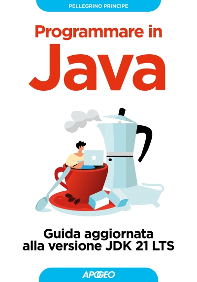

# Programmare in Java

Questo è il repository per il libro **Programmare in Java** pubblicato da Apogeo Editore.

Troverete sia tutto il codice sorgente che delle utili guide di supporto.

In poco più di **800** pagine imparerete tutto, ma proprio tutto, su uno dei linguaggi di programmazione più usati al mondo.

Il libro è aggiornato alla verione **JDK 21 LTS**.

## Anteprime Capitoli
- [Indice](Anteprime/programmare-in-java-indice.pdf)
- [Introduzione](Anteprime/programmare-in-java-introduzione.pdf) 
- [Capitolo 1](Anteprime/programmare-in-java-capitolo-1.pdf)

## Capitoli Supplementari
- Programmazione di rete

## Guide
- [Installazione Java](Guide/InstallazioneJava/README.md)
- [Sistemi Numerici](Guide/SistemiNumerici/README.md)

## Codice Sorgente (Listati e Snippets)
- [Codice Sorgente](Codice/README.md)